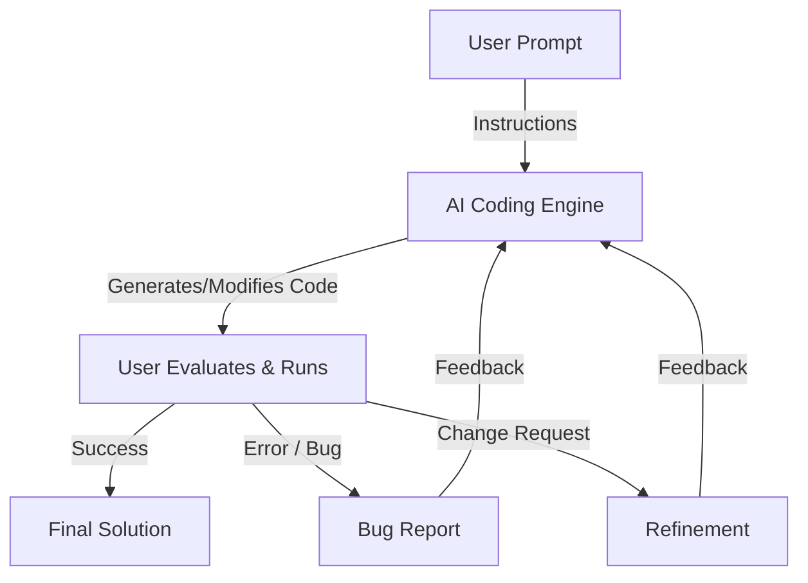

# Vibe Coding Workflow

This document explains the iterative "Vibe Coding" loop used for rapid software development.

## The Iterative Loop

## How It Works

1.  **User Prompt**: You describe the feature, fix, or concept you want to implement in natural language.
2.  **AI Creates**: The coding engine analyzes your codebase and generates the necessary files or edits.
3.  **User Runs & Evaluates**: You execute the code in your local environment.
4.  **Feedback Loop**:
    *   If there's a **bug**, you feed the error message back to the AI.
    *   If you want a **change**, you describe the adjustment.
5.  **Iteration**: The AI updates the code based on your feedback, and the loop repeats until the "vibe" is right.

## Vibe Coding Examples

### 1. Prime Finder
**User Prompt:** "Write a Python function `find_primes(n)` that returns a list of all prime numbers up to `n` using an efficient algorithm."
*   **AI creates:** Implements the Sieve of Eratosthenes.
*   **User runs:** Realizes it includes 1 as a prime.
*   **User feedback:** "1 is not a prime number, please fix the range."
*   **AI refines:** Updates the function to start the check from 2.

### 2. CSV Analyzer
**User Prompt:** "I have a CSV with 'date' and 'sales' columns. Create a plot showing the monthly sales trend."
*   **AI creates:** Generates a script using `pandas` and `matplotlib`.
*   **User runs:** The dates are not sorted correctly in the plot.
*   **User feedback:** "The chart looks messy because the dates aren't chronological. Sort the data first."
*   **AI refines:** Adds `pd.to_datetime()` and `sort_values()` before plotting.

### 3. API Prototype
**User Prompt:** "Build a simple FastAPI endpoint that takes a string and returns it reversed."
*   **AI creates:** Scaffolds a basic FastAPI app with a GET route.
*   **User runs:** Decides it should be a POST request to handle longer strings.
*   **User feedback:** "Change the endpoint to POST and use a Pydantic model for the request body."
*   **AI refines:** Updates the route and adds the `BaseModel` schema.

## Evolution of AI-Assisted Coding

The path to "Vibe Coding" has been marked by several distinct phases of AI interaction:

1.  **Code Completion (The "Ghostwriter" Era)**: Simple inline suggestions based on local context. AI acted as a sophisticated "Tab-to-complete" tool, predicting the next few tokens of code.
2.  **Chat Interface (The "Consultant" Era)**: Developers could ask questions and request snippets in a sidebar. This moved the AI from a mere typist to a technical advisor, though context management was manual and repetitive.
3.  **Plan Mode (The "Architect" Era)**: AI began proposing multi-file changes and high-level architecture before implementation. Developers could review a logical "blueprint" of the changes across the entire project structure.
4.  **Agentic Workflows (The "Partner" Era)**: Current state-of-the-art where AI has "agency." It can use tools, read documentation, create terminal sessions, run tests, and debug errors autonomously. The developer shifts from a "coder" to a "pilot" or "curator."

## Mature AI-Assisted Coding: Best Practices

As the partnership between humans and AI deepens, adopting a mature set of best practices ensures high-quality, sustainable, and responsible development.

### 1. Code Understanding & Ownership
*   **The "Explain-Back" Rule**: Periodically ask the AI to explain the *intuition* behind a generated algorithm. If you can't explain why a certain piece of code exists, you don't own it yet.
*   **Documentation as Code**: Require the AI to generate JSDoc, Docstrings, or README updates alongside the code. Accurate documentation is the bridge between AI generations and future human understanding.

### 2. Rigorous Security Reviews
*   **Zero-Trust Generation**: Assume AI-generated code is "unsafe" until proven otherwise. Check specifically for hardcoded keys, improper input sanitization, and insecure dependency versions.
*   **Automated Guardrails**: Integrate CI/CD pipelines with SAST (Static Application Security Testing) and DAST (Dynamic Application Security Testing) to catch what the human eye misses during rapid iteration.

### 3. Ethical AI Principles
*   **Bias Awareness**: Be critical of generated code that handles demographic data, hiring algorithms, or credit scoring, as models may mirror societal biases found in their training data.
*   **Intellectual Property Compliance**: Ensure the generated code adheres to your project's license. Avoid asking AI to mimic proprietary patterns or "copy-paste" logic from specific copyrighted sources.
*   **Sustainability**: Optimize for efficiency. Mature coding involves asking the AI to "profile this code for performance" or "reduce memory overhead," ensuring your application isn't just functional, but environmentally and computationally responsible.

### 4. Continuous Refactoring
*   **Combating Entropy**: AI-assisted code can lead to rapid "feature bloat." Dedicate specific iterations entirely to "Simplification Vives"—asking the AI to reduce complexity and remove redundant logic without adding new features.

## Junior Developer Learning Roadmap: AI-Assisted Coding

To move from "copy-pasting" to "vibe coding mastery," follow this staged roadmap:

### Stage 1: The Foundations (Understanding "How")
*   **Prompt Engineering**: Learn to write precise, context-rich instructions. Move beyond "write a function" to "write a stateless, pure function that handles [X] and validates [Y]."
*   **The Review Cycle**: Practice reading every line the AI generates. Look for syntax errors, logical flaws, and unused variables.
*   **Debugging with AI**: Instead of asking for a fix, feed the AI the error log and ask it to *explain why* the error happened.

### Stage 2: Context Mastery (Thinking "System-wide")
*   **Workspace Understanding**: Learn how to use feature-based search and file-reading tools to give the AI the right context. Understand that AI performance depends heavily on the files it can "see."
*   **Project Structure**: Study how your project is organized. Learn to ask AI to "follow the existing pattern in `src/utils`" to maintain consistency.
*   **Incremental Builds**: Practice breaking large features into tiny, testable iterations. Avoid the "one huge prompt" trap.

### Stage 3: The Pilot (Driving the "Agency")
*   **Terminal & Tool Use**: Get comfortable letting the AI run commands, installs, and tests. Learn to monitor the terminal output for unexpected side effects.
*   **Refactoring Vives**: Practice taking a working but "messy" piece of code and asking the AI to "refactor this for readability using Clean Code principles."
*   **Test-Driven Vibe Coding**: Ask the AI to write the test file *first*, run it (it should fail), then ask it to write the code that makes the tests pass.

### Stage 4: Mastery (Architecture & Ethics)
*   **Security Mindset**: Start every coding session by mentally checking for security risks. Prompt the AI specifically for "secure SQL queries" or "sanitized inputs."
*   **Code Ownership**: Ensure you can explain every architectural decision. If the AI suggests a library you don't know, research it before accepting.
*   **Mentorship**: Teach others how to use these tools responsibly. Learn to spot "hallucinations" (AI making up APIs or libraries) instantly.

## Expert Tips for "Vibe Coding" Mastery

Beyond the basics, these "power moves" can significantly enhance your effectiveness:

1.  **The "Sandbox" Pattern**: When trying something high-risk or exploratory, ask the AI to "create a new file `experiment.py` and implement the logic there first." Once it's "vibe checked," move it into your main codebase.
2.  **Context Injection**: If the AI is struggling with a specific library, search for the official documentation online, copy a relevant snippet, and paste it into your prompt as "Reference documentation for [Library Name]."
3.  **The "Pseudo-Code" Bridge**: If you have a complex logic in your head that's hard to describe in plain English, write the steps in comments or pseudo-code and ask the AI to "implement the logic following these steps exactly."
4.  **Linguistic Precision**: Small words matter.
    *   **"Stateless"**: Keeps functions easy to test.
    *   **"Idempotent"**: Ensures scripts can be run multiple times without side effects.
    *   **"Concise"**: Prevents the AI from adding unnecessary boilerplate.
5.  **Multi-Model Verification**: If one model gets stuck in a "logic loop" (repeating the same mistake), try describing the issue to a different model. A "fresh set of eyes" can often spot the hallucination.
6.  **The "Rubber Duck" Prompt**: Sometimes, asking the AI to "Critique my current implementation and look for logical flaws" is more valuable than asking for new code. Let it be your peer reviewer.

## Risks & Mitigation Strategies

While Vibe Coding enables high-speed development, it carries specific risks that must be managed.

| Risk | Description | Mitigation Plan |
| :--- | :--- | :--- |
| **Runtime Bugs & Edge Cases** | AI may generate logic that works for happy paths but fails on boundary conditions or null inputs. | **Always test.** Implement automated unit tests and intentionally feed the AI edge case scenarios for verification. |
| **Security Vulnerabilities** | The coding engine might suggest patterns with SQL injection, insecure defaults, or hardcoded secrets. | **Security-first prompts.** Explicitly ask for secure patterns and use static analysis tools (linters/SAST) to scan AI output. |
| **Opaque Code ("Black Box")** | You might accept code that "works" but contains logic you don't fully understand. | **Demand explanations.** Ask the AI to comment the code or explain complex blocks. Never merge what you can't explain. |
| **Skipping Human Review** | The speed of iteration can tempt users to skip the critical "read-it" phase. | **Enforce a "Read-Before-Run" rule.** Treat AI code like a PR from a junior dev; verify syntax and logic before execution. |
| **Technical Debt** | Quick "vibes" can lead to spaghetti code, lack of modularity, or inconsistent naming conventions. | **Refactor regularly.** Periodically ask the AI to "refactor for clean code principles" or "standardize naming" once a feature is stable. |
| **Dependency Bloat** | AI might suggest adding heavy libraries for simple tasks. | **Constraint-based prompting.** Guide the AI to "use standard libraries only" or "minimize external dependencies" to keep the project lean. |
