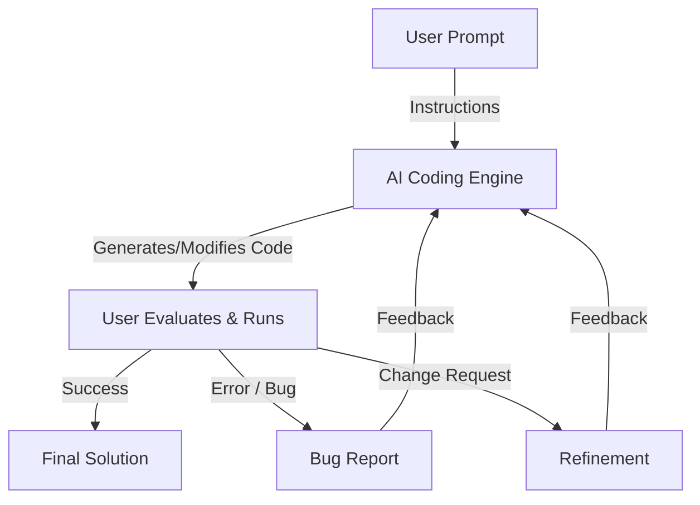

# Vibe Coding Workflow

This document explains the iterative "Vibe Coding" loop used for rapid software development.

## The Iterative Loop

## How It Works

1.  **User Prompt**: You describe the feature, fix, or concept you want to implement in natural language.
2.  **AI Creates**: The coding engine analyzes your codebase and generates the necessary files or edits.
3.  **User Runs & Evaluates**: You execute the code in your local environment.
4.  **Feedback Loop**:
    *   If there's a **bug**, you feed the error message back to the AI.
    *   If you want a **change**, you describe the adjustment.
5.  **Iteration**: The AI updates the code based on your feedback, and the loop repeats until the "vibe" is right.

## Vibe Coding Examples

### 1. Prime Finder
**User Prompt:** "Write a Python function `find_primes(n)` that returns a list of all prime numbers up to `n` using an efficient algorithm."
*   **AI creates:** Implements the Sieve of Eratosthenes.
*   **User runs:** Realizes it includes 1 as a prime.
*   **User feedback:** "1 is not a prime number, please fix the range."
*   **AI refines:** Updates the function to start the check from 2.

### 2. CSV Analyzer
**User Prompt:** "I have a CSV with 'date' and 'sales' columns. Create a plot showing the monthly sales trend."
*   **AI creates:** Generates a script using `pandas` and `matplotlib`.
*   **User runs:** The dates are not sorted correctly in the plot.
*   **User feedback:** "The chart looks messy because the dates aren't chronological. Sort the data first."
*   **AI refines:** Adds `pd.to_datetime()` and `sort_values()` before plotting.

### 3. API Prototype
**User Prompt:** "Build a simple FastAPI endpoint that takes a string and returns it reversed."
*   **AI creates:** Scaffolds a basic FastAPI app with a GET route.
*   **User runs:** Decides it should be a POST request to handle longer strings.
*   **User feedback:** "Change the endpoint to POST and use a Pydantic model for the request body."
*   **AI refines:** Updates the route and adds the `BaseModel` schema.
