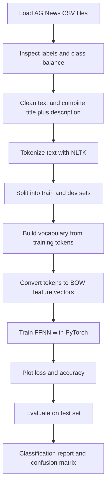
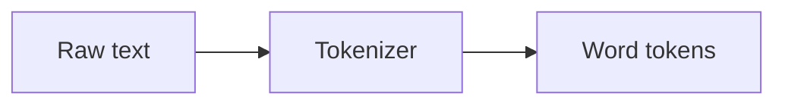
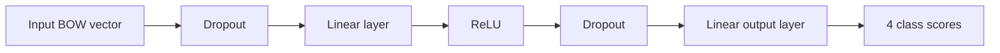
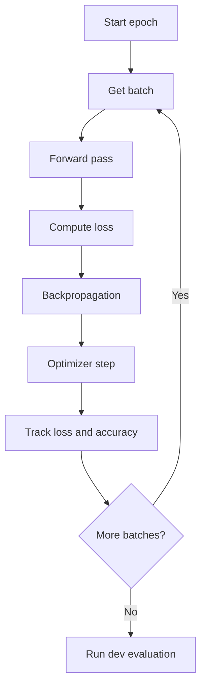
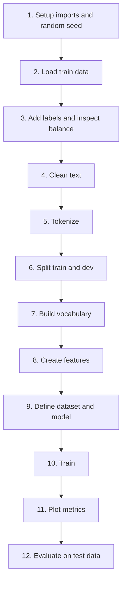

# FFNN Text Classification Notebook

This project teaches text classification with a feed-forward neural network (FFNN) using Bag of Words (BOW) features. The main learning artifact is the notebook [v2-chap07_ffnn.ipynb](./v2-chap07_ffnn.ipynb), which trains a classifier on the AG News dataset.

This README is written for junior data scientists who want to understand both what the notebook does and why each step matters.

## What You Will Learn

By working through the notebook, you will learn how to:

- load and inspect a real text classification dataset
- clean raw text and prepare it for modeling
- tokenize text into word-level units
- build a vocabulary from training data
- convert text into sparse Bag of Words features
- train a simple neural network with PyTorch
- evaluate a classifier with accuracy, a classification report, and a confusion matrix

## Notebook Goal

The notebook predicts one of four news categories from article title and description text:

- World
- Sports
- Business
- Sci/Tech

## End-to-End Pipeline



## Project Structure

```text
Gentle-NLP/
|-- README.md
|-- v2-chap07_ffnn.ipynb
|-- v2.md
`-- data/
    `-- ag_news_csv/
        |-- train.csv
        |-- test.csv
        `-- classes.txt
```

## Dataset

The notebook uses the AG News topic classification dataset stored in [data/ag_news_csv](./data/ag_news_csv).

Each example contains:

- a class index
- a title
- a description

The notebook combines the title and description into one lowercase text field, then replaces backslashes with spaces before tokenization.

## Core Ideas

### 1. Bag of Words

Bag of Words ignores word order and represents a document by counting how often each vocabulary term appears.

Example:

- text: `market falls as oil rises`
- tokens: `[market, falls, as, oil, rises]`
- BOW vector: counts for those words in the vocabulary

This is simple, fast, and still useful for baseline text classification.

### 2. Tokenization

Tokenization breaks text into smaller parts, usually words and punctuation.



In this notebook, tokenization is done with NLTK's `word_tokenize`.

### 3. Feed-Forward Neural Network

After text is converted into numeric BOW vectors, the model learns patterns that connect word counts to class labels.



The notebook uses:

- an input layer sized to the vocabulary
- one hidden layer with 50 units
- ReLU activation
- dropout for regularization
- an output layer with 4 scores, one per class

## Notebook Walkthrough

### 1. Initialization

The notebook imports PyTorch, NumPy, pandas, and tqdm, then sets a random seed for reproducibility.

It also picks a device automatically:

- `cuda` if a compatible GPU is available
- `cpu` otherwise

### 2. Load and Explore the Training Data

The training CSV is loaded into a pandas DataFrame. Then the class names from `classes.txt` are added so the labels are easier to interpret.

The notebook also plots label counts to confirm that the classes are balanced.

### 3. Clean the Text

The notebook creates a new `text` column by concatenating the title and description. It lowercases the text and replaces stray backslashes with spaces.

### 4. Tokenize the Text

The cleaned text is tokenized with NLTK.

The notebook now downloads `punkt_tab` and `punkt` automatically before tokenization, which helps avoid common NLTK resource errors in fresh environments.

### 5. Train and Dev Split

The dataset is split into:

- 80% training data
- 20% development data

The split is:

- reproducible through `random_state=seed`
- stratified by class label so class balance is preserved

### 6. Build the Vocabulary

The notebook counts tokens in the training set and keeps only tokens whose frequency is above a threshold.

This reduces noise and keeps the feature space manageable.

Special handling:

- `[UNK]` is used for unknown tokens not seen often enough in training

### 7. Convert Tokens to Feature Vectors

Each document is converted into a sparse dictionary of token counts. The custom PyTorch dataset then expands that sparse representation into a dense tensor when an item is requested.

### 8. Train the Neural Network

The model is trained with:

- `CrossEntropyLoss` for multi-class classification
- `Adam` optimizer
- batch size of `500`
- `5` epochs



During training, the notebook stores:

- training loss
- development loss
- training accuracy
- development accuracy

These values are later plotted to help you see whether the model is learning or overfitting.

### 9. Evaluate on the Test Set

The notebook repeats preprocessing for the test set, runs the trained model, and reports:

- per-class precision, recall, and F1-score
- overall accuracy
- a normalized confusion matrix

These outputs help answer two questions:

- How well does the model perform overall?
- Which classes does it confuse most often?

## Recommended Run Order

Run the notebook from top to bottom.



If the kernel restarts, rerun the earlier cells before continuing because later steps depend on variables created above them.

## Environment Notes

The notebook currently expects these Python packages:

- torch
- numpy
- pandas
- matplotlib
- nltk
- tqdm
- scikit-learn

If `scikit-learn` is missing, install it in the notebook kernel.

If NLTK tokenization fails because tokenizer data is missing, the notebook already includes code to download the required resources.

The notebook also avoids the `ipywidgets` dependency path for tqdm, which makes it more reliable in lightweight notebook environments.

## What to Watch For as You Learn

As you run the notebook, pay attention to these questions:

- Does the development accuracy improve over epochs?
- Does development loss stop improving while training loss keeps dropping?
- How large is the vocabulary after thresholding?
- Which classes are easiest or hardest to separate?
- What information does BOW lose compared with more advanced text encoders?

## Good Follow-Up Exercises

Once you understand the notebook, try these extensions:

1. Change the vocabulary threshold and see how performance changes.
2. Increase or decrease the hidden layer size.
3. Add more epochs and compare train versus dev curves.
4. Replace BOW with TF-IDF features.
5. Compare this FFNN baseline with an embedding-based model.

## Summary

This notebook is a strong baseline project for learning practical NLP. It shows the full workflow from raw text to evaluation without hiding the mechanics behind a large framework.

For junior data scientists, that is the main value here: you can see each stage clearly, understand what data is flowing through the pipeline, and build intuition before moving on to more advanced models.
