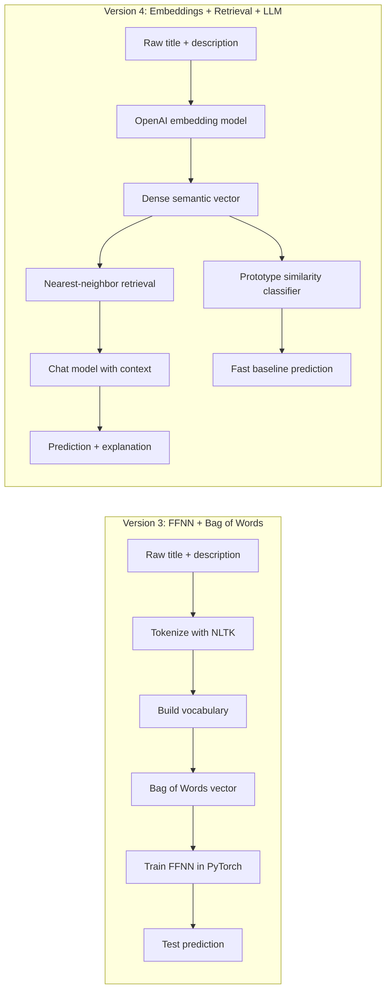
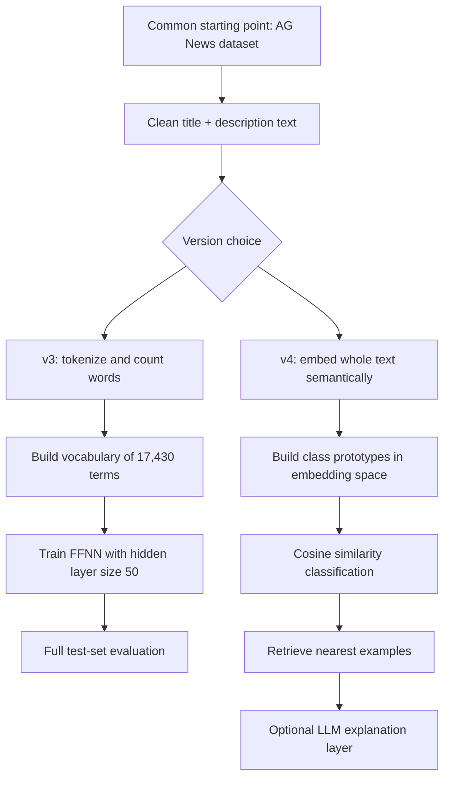
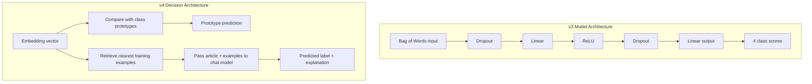
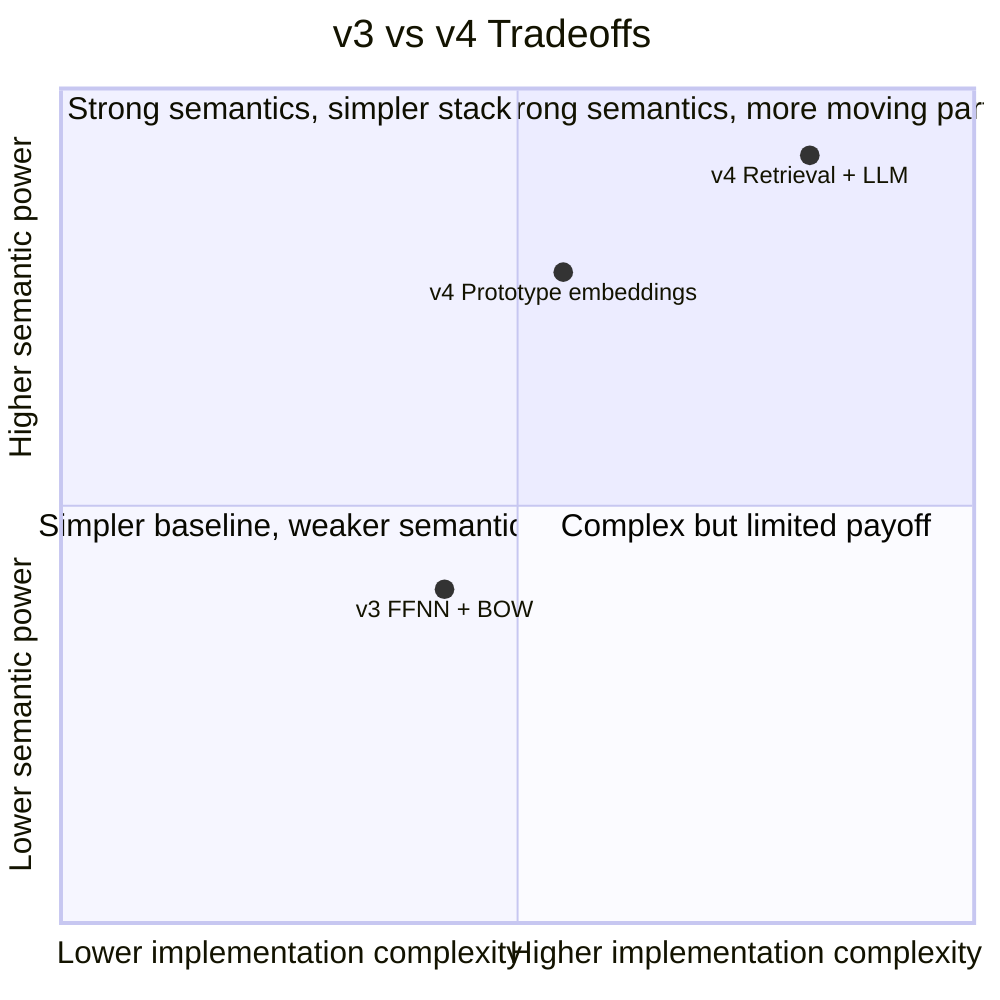

# Comparing v3 and v4 Text Classification Notebooks

This document compares the two main notebook versions in this repo:

- `v3-chap07_ffnn.ipynb`: Bag of Words plus a feed-forward neural network
- `v4-chap08_llm_embeddings_openai.ipynb`: OpenAI embeddings plus retrieval and LLM-assisted classification

Both notebooks solve the same AG News classification problem, but they represent text, train models, and explain predictions in very different ways.

## Executive Summary

Version 3 is a classic supervised NLP pipeline. It converts text into sparse word-count vectors, trains a PyTorch neural network, and evaluates it on the full test set. It is a strong baseline for learning core ML workflow concepts such as tokenization, vocabulary building, feature engineering, minibatch training, and model evaluation.

Version 4 shifts the focus from training a task-specific neural network to using pretrained semantic representations. It embeds articles with an OpenAI embedding model, classifies with cosine similarity against class prototypes, retrieves nearest examples, and optionally asks a chat model to produce a label with an explanation. It is better for teaching semantic search, retrieval-augmented classification, and modern API-based NLP workflows.

## High-Level Difference

## Side-by-Side Comparison

| Area | v3: FFNN + BOW | v4: Embeddings + LLM |
|---|---|---|
| Main idea | Learn from word counts | Use pretrained semantic vectors |
| Text representation | Sparse Bag of Words | Dense embeddings |
| Core model | PyTorch feed-forward neural network | Prototype classifier plus optional chat model |
| Data scale used in notebook | `96,000` train, `24,000` dev, full `7,600` test evaluation | `2,000` embedding train, `400` embedding eval, `24` LLM eval |
| Feature engineering | Tokenization, vocabulary, unknown token handling, count vectors | Minimal manual feature engineering after text cleanup |
| Training requirement | Yes, train a neural model for `5` epochs | No task-specific gradient training for the main classifier |
| External API dependency | No OpenAI dependency required for core modeling | Requires OpenAI API for embeddings and chat classification |
| Explainability | Mostly indirect via metrics and confusion matrix | Retrieved examples plus natural-language explanation |
| Cost profile | Mostly local compute | API cost and latency matter |
| Reproducibility | Higher, assuming same environment and seed | Lower, because API calls and LLM outputs can vary |
| Best teaching use | Fundamentals of classical NLP classification | Modern semantic retrieval and LLM-assisted pipelines |

## Pipeline Evolution

## What v3 Teaches Well

- How raw text becomes tokens.
- How a vocabulary is built from training data.
- Why sparse feature vectors work as a baseline.
- How minibatch training, loss functions, and optimizers fit together.
- How to evaluate a classifier with a classification report and confusion matrix.

Important concrete details from the notebook:

- Training split: `96,000` rows
- Dev split: `24,000` rows
- Vocabulary size: `17,430`
- Hidden layer size: `50`
- Dropout: `0.3`
- Batch size: `500`
- Epochs: `5`
- Saved test accuracy in the notebook output: `0.92`

This makes v3 the better notebook if the goal is to understand how a text classifier is built from first principles.

## What v4 Teaches Well

- Why semantic embeddings are often more expressive than raw word counts.
- How cosine similarity can classify without training a neural network from scratch.
- How retrieval can surface useful supporting examples.
- How an LLM can turn retrieved evidence into a prediction plus explanation.
- How modern NLP systems combine representations, retrieval, and generation.

Important concrete details from the notebook:

- Embedding model: `text-embedding-3-small`
- Chat model: `gpt-4.1-mini`
- Embedding training rows: `2,000`
- Embedding evaluation rows: `400`
- LLM evaluation rows: `24`
- Saved prototype accuracy in the notebook output: `0.897`

The notebook also includes an LLM-evaluation stage on a small subset. The code prints `llm subset accuracy`, but a saved numeric output is not currently present in the notebook file, so that figure should be treated as run-time dependent.

## Architecture Comparison

## Tradeoff Map

## When to Prefer Each Version

Choose v3 when you want:

- a local baseline without paid API calls
- a notebook that teaches classical supervised NLP end to end
- more direct control over training and model behavior
- evaluation on a larger held-out set

Choose v4 when you want:

- semantic similarity instead of exact token overlap
- a smaller amount of task-specific setup
- interpretable retrieval examples
- a bridge into retrieval-augmented generation and LLM workflows

## Bottom Line

Version 3 is the better notebook for learning how text classification systems are built.

Version 4 is the better notebook for learning how modern NLP systems increasingly work in practice.

They are not competitors so much as stages in maturity:

1. v3 teaches representation, training, and evaluation from scratch.
2. v4 teaches how pretrained embeddings and LLMs can reduce manual feature engineering and add explanation-oriented behavior.
3. Together they show the shift from sparse symbolic features to dense semantic representations.