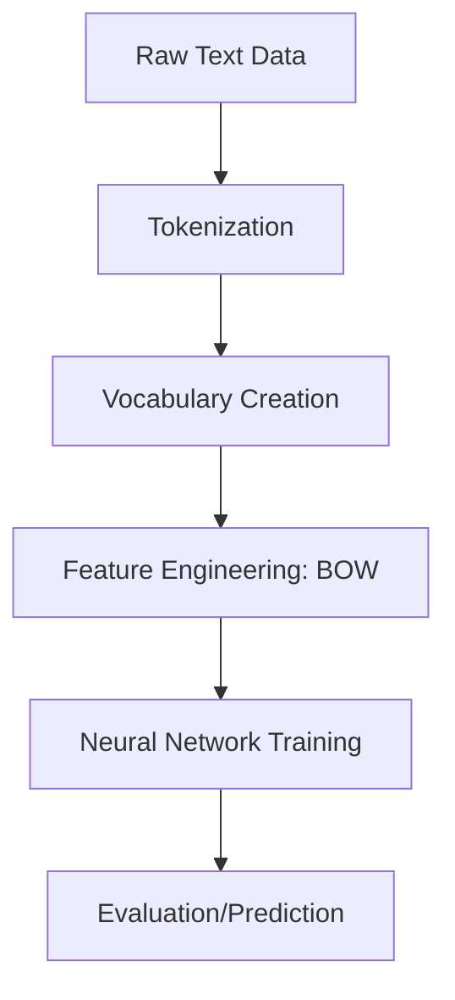
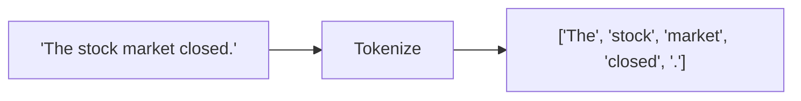
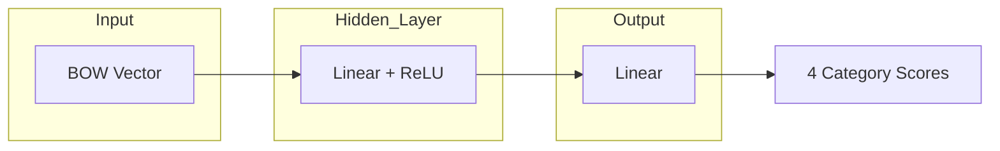
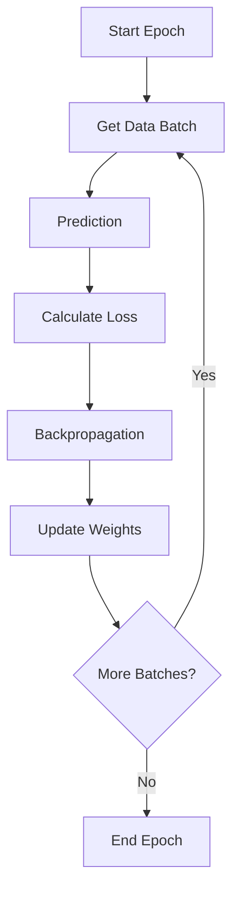

##  Pipeline

## Feature Engineering: Tokenization

Tokenization is the process of splitting text into small units (tokens), usually words.

### Understanding the Architecture
Our model is a Simple Feed-Forward Neural Network:

*   **Linear Layers**: Perform matrix multiplication ($y = xW^T + b$).
*   **ReLU**: The standard choice for "sparking" hidden neurons into life.
*   **Dropout**: Helps the model generalize by making it not overly dependent on specific words.

###  The Training Loop

Training is an iterative process:

During each step, the ***\*Optimizer\**** updates the model's weights to minimize the ***\*Loss Function\**** (error).